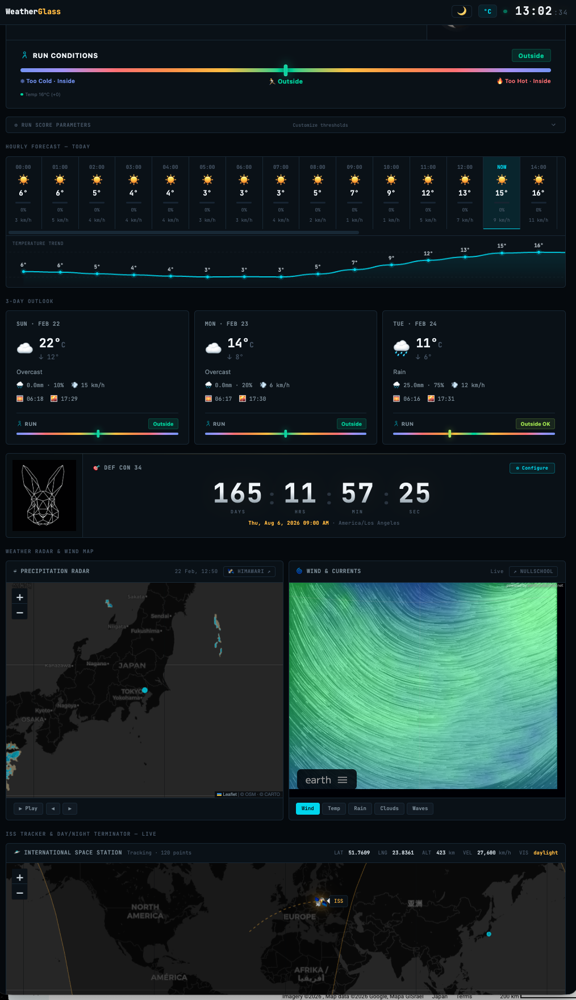
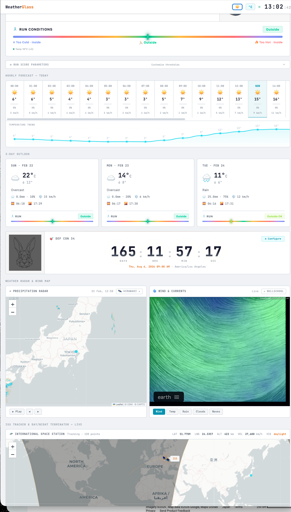

<p align="center">
  
</p>

<h1 align="center">WeatherGlass</h1>

<p align="center">
  A self-hosted weather dashboard with real-time conditions, forecasts, radar, wind maps, ISS tracking, and a configurable countdown timer — all in a single Flask app.
</p>

<p align="center">
  
  
  
</p>

---

## Features

- **Current conditions** — temperature, humidity, wind, precipitation, feels-like, WMO weather icons
- **AMeDAS live data** — real-time JMA station observations when located in Japan
- **Hourly forecast** — 24-hour strip with precipitation bars and synced temperature graph
- **3-day outlook** — daily cards with hi/lo temps, rain probability, sunrise/sunset
- **Run conditions gauge** — configurable scoring system for outdoor running suitability
- **Countdown timer** — customizable event countdown with 7-segment display (default: DEF CON 34)
- **Precipitation radar** — animated RainViewer overlay with playback controls
- **Wind & currents map** — nullschool.net with layer switching (wind/temp/rain/clouds/waves)
- **ISS tracker** — real-time orbital position, trail, day/night terminator
- **Moon phase** — photorealistic canvas-rendered moon with illumination data
- **Dark / Light theme** — toggle between dark and light mode, persists across sessions
- **°C / °F toggle** — switch temperature units globally
- **Configurable location** — paste a Google Maps URL or enter coordinates manually

## Screenshots

| Dark Mode | Light Mode |
|:-:|:-:|
|  |  |

*Replace these placeholders with actual screenshots of your deployment.*

---

## Quick Start

```bash
git clone https://github.com/elkentaro/weatherglass.git
cd weatherglass

python3 -m venv venv
source venv/bin/activate
pip install -r requirements.txt

python app.py
```

Open **http://localhost:5099** — default location is Tokyo. Click **⚙ Set Location** to change it.

---

## Configuration

All configuration is done through the browser UI and persisted in `localStorage`:

| Setting | How to change |
|---|---|
| **Location** | Click "⚙ Set Location" → paste a Google Maps URL or enter lat/lng |
| **Temperature unit** | Click °C/°F toggle in the top bar |
| **Theme** | Click ☀️/🌙 toggle in the top bar |
| **Run thresholds** | Expand "Run Score Parameters" panel |
| **Countdown** | Click "⚙ Configure" on the countdown timer |

### Google Maps URL Parsing

The location modal accepts Google Maps URLs in these formats:
- `https://www.google.com/maps/place/.../@35.6762,139.6503,14z`
- `https://www.google.com/maps?q=48.8566,2.3522`
- URLs with `!3d...!4d...` data parameters

---

## Production Deployment

### Install as a systemd service

```bash
# 1. Create a service user
sudo useradd -r -s /usr/sbin/nologin weatherglass

# 2. Clone and set up
sudo mkdir -p /opt/weatherglass
sudo cp -r app.py templates/ static/ requirements.txt /opt/weatherglass/
sudo chown -R weatherglass:weatherglass /opt/weatherglass

# 3. Create venv and install dependencies
sudo -u weatherglass python3 -m venv /opt/weatherglass/venv
sudo -u weatherglass /opt/weatherglass/venv/bin/pip install -r /opt/weatherglass/requirements.txt

# 4. Install and enable the service
sudo cp weatherglass.service /etc/systemd/system/
sudo systemctl daemon-reload
sudo systemctl enable --now weatherglass

# 5. Verify
sudo systemctl status weatherglass
journalctl -u weatherglass -f
```

The dashboard will be available at `http://<your-server>:5099`.

### Changing the port

Edit the last line of `app.py`:

```python
app.run(host="0.0.0.0", port=8080, debug=False)
```

### Reverse proxy (nginx)

```nginx
server {
    listen 80;
    server_name weather.example.com;

    location / {
        proxy_pass http://127.0.0.1:5099;
        proxy_set_header Host $host;
        proxy_set_header X-Real-IP $remote_addr;
        proxy_set_header X-Forwarded-For $proxy_add_x_forwarded_for;
        proxy_set_header X-Forwarded-Proto $scheme;
    }
}
```

---

## Project Structure

```
weatherglass/
├── app.py                  # Flask backend — API proxies + caching
├── templates/
│   └── weather.html        # Single-page frontend (CSS + JS inline)
├── static/
│   └── bunny.png           # Countdown mascot
├── weatherglass.service    # systemd unit file
├── requirements.txt        # Python dependencies
├── LICENSE
├── .gitignore
└── README.md
```

---

## API Endpoints

| Endpoint | Description |
|---|---|
| `GET /` | Dashboard |
| `GET /api/weather?lat=&lng=&tz=` | Open-Meteo forecast (cached 10 min) |
| `GET /api/amedas?lat=&lng=` | JMA AMeDAS station data (Japan only, cached 5 min) |
| `GET /api/iss` | ISS position (cached 3 sec) |
| `GET /api/timezone?lat=&lng=` | Timezone lookup via Open-Meteo |
| `GET /api/health` | Connectivity check — tests all upstream APIs |

All endpoints accept `lat` and `lng` query parameters, defaulting to Tokyo (35.5627, 139.6899).

### Health Check

Hit `/api/health` to diagnose connectivity issues. Returns status, latency, and response size for each upstream API:

```json
{
  "open-meteo": {"ok": true, "status": 200, "ms": 342},
  "rainviewer": {"ok": true, "status": 200, "ms": 198},
  "iss":        {"ok": true, "status": 200, "ms": 567},
  "jma-amedas": {"ok": true, "status": 200, "ms": 89}
}
```

---

## Data Sources

| Source | Provides |
|---|---|
| [Open-Meteo](https://open-meteo.com) | Forecast data (current, hourly, daily) |
| [JMA AMeDAS](https://www.jma.go.jp/bosai/amedas/) | Real-time station observations (Japan) |
| [RainViewer](https://www.rainviewer.com) | Global precipitation radar tiles |
| [nullschool.net](https://earth.nullschool.net) | Wind/temp/ocean visualisation |
| [Where the ISS at?](https://wheretheiss.at) | ISS orbital position |
| [Weather Underground](https://www.wunderground.com) | External weather link |
| [Himawari-9](https://himawari.asia/) | Satellite imagery link |

---

## Tech Stack

**Backend:** Python 3.10+, Flask, Requests

**Frontend:** Vanilla JS, CSS custom properties, Leaflet + Leaflet Terminator

**Fonts:** JetBrains Mono (Google Fonts CDN)

**Maps:** CARTO basemap tiles (dark + light variants)

---

## Troubleshooting

| Symptom | Fix |
|---|---|
| Dashboard shows "Loading..." forever | Check `/api/health` — likely a blocked outbound connection |
| AMeDAS shows "unavailable" | Normal outside Japan. AMeDAS only works within JMA's coverage area |
| Radar map is blank | RainViewer API is fetched client-side — check browser console for CORS or network errors |
| Clock shows wrong time | Click "⚙ Set Location" and re-save — timezone is auto-detected from coordinates |
| Countdown shows wrong time | Click "⚙ Configure" — make sure the event timezone is correct (e.g. `America/Los_Angeles`) |

---

## License

[MIT](LICENSE)
